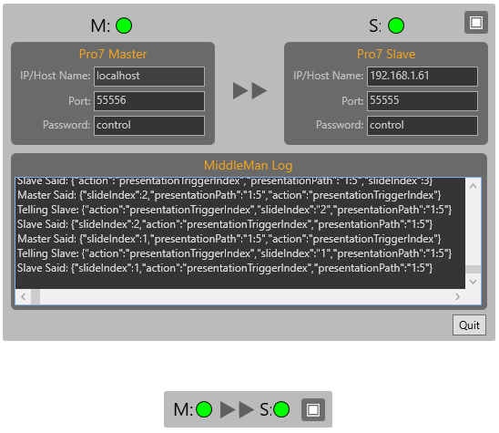

# Pro7RemoteMiddleMan
A "Middle-Man" Windows application to provide simple Master-Slave functionality between two machines running ProPresenter 7.
You can run this on any Windows PC on your network and then enter network details for two Pro7 machines to setup a Master-Slave control between them.  (NB. Only slide triggers are supported - no clear actions are sent)

I just wanted to test the idea of creating a middle-man application to create a Master-Slave setup with ProPresenter 7.
It uses the mobile App remote protocol to connect to two separate Pro7 machines anywhere on your network via websockets.
It listens for notifications of slides being triggered in the "master" Pro7 and sends trigger commands for same presentation/slide to the "slave" Pro7.

Note: Not all master-slave functionality is possble with the remote protocol (This is because there are no notification messages sent from Pro7 to the remote app when a user perfroms on clear actions.)

This project was made in Visual Studio 2019 Community edition and uses WebSocket4Net pacakge by Kerry Jiang (NuGet Package)

This applicaton is now a "minimum viable product" that could be used by a non-programmer. Download a pre-built, ready to run release from here: https://github.com/greyshirtguy/Pro7RemoteMiddleMan/releases

I'll probably leave this much like it is since RV will likely soon release new features that make this no longer required.

Ideas to improve:
* Each time it sends a slide trigger message to slave, then app should await confirmation from slave - otherwise resend the slide trigger message (perhaps just once after say 1000ms-ish)
